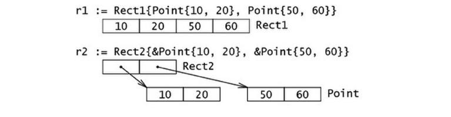

Go通过类型别名和结构体的形式支持用户自定义类型，或者叫定制类型。组成结构提的那些数据称为
字段(fields)，每个字段都有一个类型和一个名字; 在一个结构体中，字段名字必须是唯一的。


结构体定义的一般方式如下： 

```go
type identifier strcut {
	field1 type1
	field2 type2
}
```

结构体的字段可以是任何类型，甚至是结构体本身，也可以是函数或接口。

## 使用new 

使用new函数给一个新的结构体变量分配内存，它返回指向已分配内存的指针： `var t *T=new(T)`或者
`t:=new(T)`；声明`var t T`也会给t分配内存，并零值化内存，但t是类型T。

```go
type myStruct struct { i int }
var v myStruct    // v是结构体类型变量
var p *myStruct   // p是指向一个结构体类型变量的指针
v.i
p.i
```

不同初始化方式的内存布局 


## 结构体的内存布局

go语言中，结构体和它所包含的数据在内存中是以连续块的形式存在的，在性能上带来巨大的优势。



## 递归结构体 

结构体类型可以通过引用自身来定义。这在定义链表或二叉树的元素特别有用 

单链表
```go
type Node struct {
    data    float64
    su      *Node
}
```

双向链表
```go
type Node struct {
    pr      *Node
    data    float64
    su      *Node
}
```

## 结构体转换

Go中的类型转换遵循严格的规则。当为结构体定义了一个alias类型时，可以互相转换

```go
package main
import "fmt"

type number struct {
    f float32
}

type nr number   // alias type

func main() {
    a := number{5.0}
    b := nr{5.0}
    // var i float32 = b   // compile-error: cannot use b (type nr) as type float32 in assignment
    // var i = float32(b)  // compile-error: cannot convert b (type nr) to type float32
    // var c number = b    // compile-error: cannot use b (type nr) as type number in assignment
    // needs a conversion:
    var c = number(b)
    fmt.Println(a, b, c)
}
```

